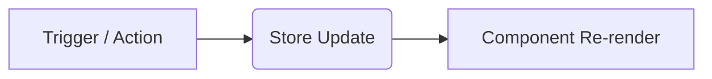

# 🤖 AGENTS.md • CrossLeague Agent Operating Manual

This document provides AI coding agents and autonomous coding assistants with architectural rules, topic navigation links, development workflows, commit and pull request guidelines, and documentation synchronization rules for working in the **CrossLeague** repository.

---

## 🎯 Core Repository Tenets

1. **Static, Client-Side React Application**:
   CrossLeague is a client-side React 19 + TypeScript application built with Vite and Tailwind CSS. It runs entirely in the user's browser with zero backend server dependencies.
2. **Zustand Central State Store**:
   Shared UI and league data state is managed exclusively via the Zustand store in `src/js/state/useCrossLeagueStore.js`. Use store actions rather than duplicating state across components.
3. **Pure Functional Analytics**:
   All statistical and analytical algorithms in `src/js/analytics/` are pure functions that take data structures and return computed results without side effects.
4. **Strict Visual & Icon Language**:
   Use **Lucide React** (`lucide-react`) for UI icons. Do not add raw emoji characters to the user interface (the Discord/Slack chat recap markdown generator is the sole intentional exception).
5. **Deterministic Snapshot Testing**:
   Visual regression snapshot generation (`scripts/generate-snapshots.js`) disables animations, transitions, and carets to ensure deterministic pixel verification across environments.

---

## 🧭 Topic Navigation Index for Agents

When tasked with specific features, fixes, or refactors, consult these technical guides:

| Topic / Domain                                              | Reference Documentation                                    | Primary Source Directory                        | Key Test File                      |
| :---------------------------------------------------------- | :--------------------------------------------------------- | :---------------------------------------------- | :--------------------------------- |
| **All-Play, Expected Wins, Luck Index, Efficiency, StdDev** | [`docs/analytics.md`](docs/analytics.md)                   | `src/js/analytics/`                             | `tests/analytics.test.js`          |
| **Sleeper & ESPN APIs, Slot Mappings, Roster Parsers**      | [`docs/api-adapters.md`](docs/api-adapters.md)             | `src/js/api/`, `src/js/services/`               | `tests/espn.test.js`               |
| **Zustand State Store, LocalStorage, TTL Caching**          | [`docs/state-and-caching.md`](docs/state-and-caching.md)   | `src/js/state/`                                 | `tests/cache.test.js`              |
| **URL Search Params, Aliases, Deep Linking**                | [`docs/url-parameters.md`](docs/url-parameters.md)         | `src/js/state/urlParams.js`                     | `tests/share.test.js`              |
| **React Components, Tabs, Modals, Lucide Icons**            | [`docs/ui-components.md`](docs/ui-components.md)           | `src/js/components/`                            | `tests/react-interactions.test.js` |
| **Chat Recaps, CSV Export, Shareable Links**                | [`docs/export-and-sharing.md`](docs/export-and-sharing.md) | `src/js/export/`                                | `tests/recap.test.js`              |
| **System Architecture, React App Shell, Build Pipeline**    | [`docs/architecture.md`](docs/architecture.md)             | `src/js/components/App.tsx`, `scripts/build.js` | `tests/bundle.test.js`             |
| **Developer Workflows, Taskfile, TypeScript, Knip**         | [`docs/development.md`](docs/development.md)               | `Taskfile.yaml`, `tsconfig.json`                | `tests/snapshots.test.js`          |

---

## ⚡ Task Commands Reference

Always invoke development workflows through `task` (the project's task runner) rather than raw CLI commands:

```bash
# Install all development dependencies and pre-commit hooks
task install

# Run the complete verification pipeline (format, lint, types, knip, test, build sync check)
task check

# Execute automated tests via Node.js native test runner
task test

# Run a specific targeted test file
task test -- tests/analytics.test.js

# Auto-fix code formatting (Prettier) and linting (ESLint)
task fix

# Type check TypeScript files without emitting code
task typecheck

# Check for unused files, exports, and dependencies with Knip
task check:knip

# Compile production bundles and update dist/
task build

# Start local live-reloading Vite dev server
task dev

# Start Cloudflare Pages local preview server
task pages:dev

# Generate visual PNG snapshots with headless Chrome
task snapshots

# Verify visual snapshot headers and dimensions
task snapshots:check
```

---

## 📐 Coding Conventions & Guidelines

### React & TypeScript Standards

- Write modular functional components with React 19 and strict TypeScript typings (`src/js/types/index.ts`).
- Keep components responsive using standard Tailwind CSS classes and `glass-card` styling tokens.
- Maintain accessibility: icon-only buttons require an accessible `title` / `aria-label`, and interactive controls must support keyboard navigation.
- Use Zustand selectors (e.g. `useCrossLeagueStore(s => s.rawRecords)`) to prevent unnecessary re-renders.

### Header & Navigation Architecture

- The header is viewport-fixed (`Header.tsx`). `App.tsx` supplies responsive top padding for mobile bottom nav, tablet tabs, and desktop navigation.
- The current platform is displayed in `#headerPlatformBadge` next to the season badge. Do not repeat platform badges in table rows.
- The platform selector resides inside the Settings menu.

### Data & Table Behavior

- `rawRecords` in the store is the single source of truth; `useActiveRecords()` filters records by selected leagues.
- Single-week records use `outcome` (`win`, `loss`, `tie`) and `opponentName`. Season rollups use `rawWins`, `rawLosses`, and `rawTies`.
- Preserve table sorting, searching, pagination, and expandable row behavior when modifying table views.

### Build Synchronization Rule

- Whenever you modify files in `src/`, ensure you run `task build` (or `task check`) to re-generate the artifacts in `dist/`.
- CI strictly checks that `dist/index.html`, `dist/app.min.js`, and `dist/styles.min.css` match the source files via `task check:build`.

---

## 📝 Committing Code & Git Standards

When committing code in this repository, follow the **Gitmoji** specification:

```
<intention> [scope?][:?] <message>

[optional body]

[optional footer(s)]
```

### Gitmoji Reference Table

| Emoji | Intent                       | Example                                              |
| :---- | :--------------------------- | :--------------------------------------------------- |
| ✨    | New feature or capability    | `✨ (players): add positional depth exposure metric` |
| 🐛    | Bug fix                      | `🐛 (espn): fix slot ID mapping for FLEX starters`   |
| ♻️    | Refactoring code             | `♻️ (state): extract selector hooks from store`      |
| 📝    | Documentation updates        | `📝 (docs): update architecture data flow diagram`   |
| 💄    | UI, styles, or visual design | `💄 (header): improve mobile navigation spacing`     |
| 🧪    | Adding or updating tests     | `🧪 (analytics): add edge cases for All-Play ties`   |
| ⚡    | Performance optimization     | `⚡ (cache): optimize in-memory TTL lookup Map`      |
| 🔧    | Configuration or tooling     | `🔧 (knip): add ignore rules for export subpaths`    |
| 👷    | CI/CD build or workflow      | `👷 (ci): add snapshot artifact upload on failure`   |
| 🗑️    | Deprecate or remove code     | `🗑️ (legacy): remove obsolete DOM modal helpers`     |

### Pre-Commit Verification Checklist

Before staging and committing your changes, always run:

1. `task fix` — Automatically formats files and fixes linting.
2. `task check` — Runs style checks, TypeScript compiler, Knip, unit tests, and verifies bundle synchronization.
3. `task snapshots:check` — Ensures visual snapshots match baselines.
4. **Clean Staging**: Never commit generated temporary files (e.g. `tests/.snapshot-tmp/`), secret files, or unrelated formatting diffs.
5. **No Co-Author Attributions**: Do not add yourself or agent co-author credits unless explicitly requested.

---

## 🚀 Pull Request Etiquette & Template

Pull requests must follow the repository's conventional structure.

### PR Title

Format: `<intention> [scope?][:?] <message>` (e.g. `✨ (luck): add interactive methodology tooltip`).

### Standard PR Template

````markdown
## Summary

[Concise summary of what this PR achieves.]

## Context

[The "why" behind this work — feature, bugfix, or chore reasoning.]

## Changes

<details><summary>Code Changes</summary>
<p>

- **`src/js/components/...`**
  - Detailed description of changes.
- **`docs/...`**
  - Documentation updates matching the code changes.

</p>
</details>

## Test Plan

- [x] Ran `task check` (formatting, linting, typecheck, knip, unit tests, build check).
- [x] Ran `task snapshots:check` (visual snapshot verification).
- [ ] Manual verification in browser / dev server.

## Behavior Diagram


````

````

> [!IMPORTANT]
> Do not credit yourself on PRs or add "Created by AI Agent" disclaimers unless explicitly requested by the user.

---

## 📖 Keeping Documentation Up to Date

Documentation in CrossLeague is a first-class citizen. Whenever code is modified, agents must keep all documentation in sync:

```mermaid
flowchart TD
    Change[Code / Feature / Architecture Change] --> Router{What changed?}
    Router -->|Mathematical Model / Metric| DocAnalytics["docs/analytics.md"]
    Router -->|API Adapter / Schema / Payload| DocApi["docs/api-adapters.md"]
    Router -->|State Store / Cache / Preferences| DocState["docs/state-and-caching.md"]
    Router -->|URL Parameters / Deep Links| DocUrl["docs/url-parameters.md"]
    Router -->|React Component / UI / Icons| DocUi["docs/ui-components.md"]
    Router -->|Export Formats / Chat / CSV| DocExport["docs/export-and-sharing.md"]
    Router -->|Taskfile / Build / CI / Testing| DocDev["docs/development.md"]
    Router -->|High-Level Features / UI Showcase| DocReadme["README.md & snapshots/"]
    Router -->|Agent Rules / Conventions / Navigation| DocAgents["AGENTS.md"]

    DocAnalytics & DocApi & DocState & DocUrl & DocUi & DocExport & DocDev & DocReadme & DocAgents --> Verify["Run task check & task fix"]
````

### Documentation Sync Rules

1. **Feature / Behavior Changes**: When introducing new metrics, modifying algorithms, or altering data shapes, update the relevant `docs/*.md` file immediately.
2. **UI Changes & Snapshots**: When modifying UI visuals or layout intentionally, regenerate snapshots with `task snapshots` and update [`README.md`](README.md) visual previews if applicable.
3. **Build Artifacts**: Always ensure `dist/` is updated via `task build` (or `task check`) whenever source code in `src/` changes.
4. **Agent Navigation**: Keep the [Topic Navigation Index](#-topic-navigation-index-for-agents) up to date whenever new modules or test suites are added.

---

## ⚠️ Common Pitfalls & Edge Cases

1. **ESPN Slot ID Mappings**:
   Lineup slot `20` is **Bench** and `21` is **IR**. All other slot IDs (`0`, `2`, `4`, `6`, `16`, `17`, `23`) represent active starters (`isEspnStarter(slotId)`).
2. **ESPN Player ID Normalization**:
   Always prefix ESPN player IDs with `espn_` (e.g. `espn_4040715`) to prevent collisions with Sleeper player IDs.
3. **CORS on ESPN API**:
   Direct requests to ESPN's LM-API may fail CORS in browser environments. The adapter automatically handles proxy fallback (`https://corsproxy.io/?...`).
4. **All-Play Tiebreaking**:
   Sort primary by `allPlayWinPct` descending, secondary by `totalPoints` / `points` descending.
5. **No Runtime Report Generation Machinery**:
   Do not reintroduce the removed standalone HTML template exporter; exports are handled via CSV and Discord/Slack chat recaps.
