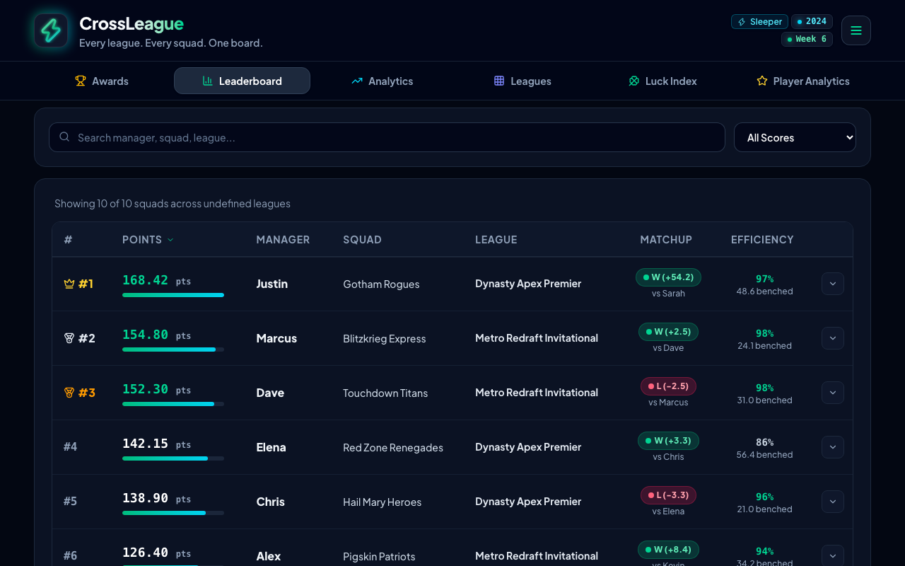
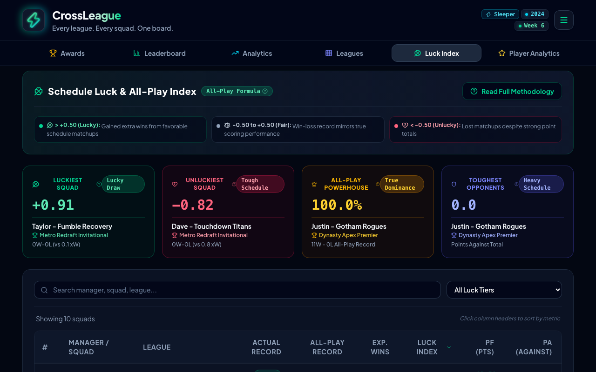
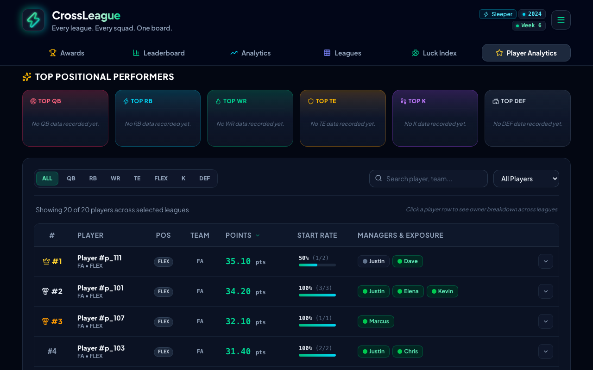
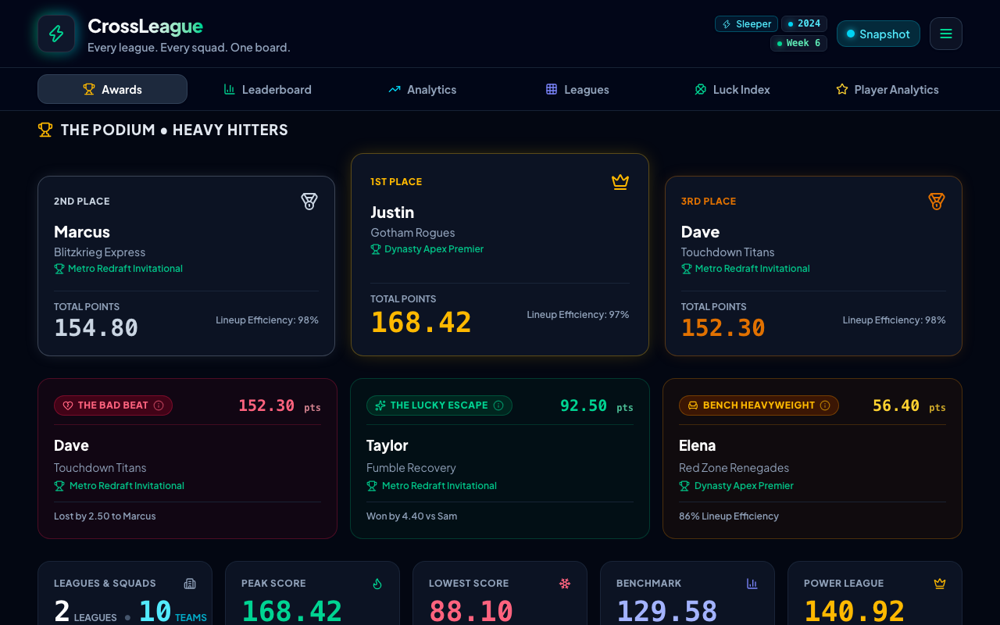
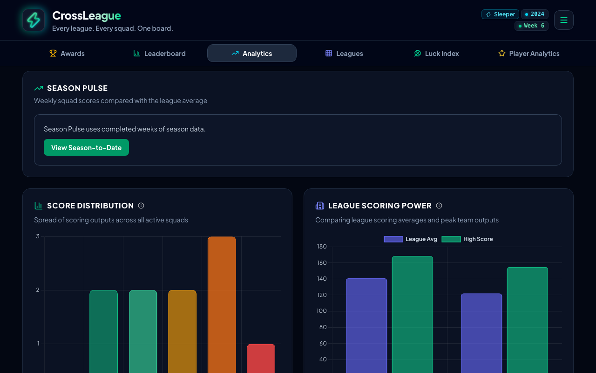
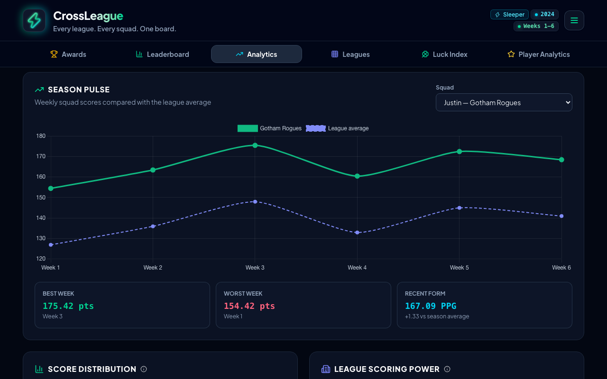

<h1 align="center">
  <br>
  CrossLeague
</h1>

<p align="center">
Universal fantasy football power rankings and multi-league analytics dashboard.
</p>

<p align="center">
  <a href="https://github.com/juftin/crossleague/releases"></a>
  <a href="https://github.com/juftin/crossleague/blob/main/LICENSE"></a>
  <a href="https://github.com/juftin/crossleague/actions/workflows/ci.yaml?query=branch%3Amain"></a>
  <a href="https://react.dev"></a>
  <a href="https://www.typescriptlang.org"></a>
  <a href="https://github.com/go-task/task"></a>
  <a href="https://github.com/semantic-release/semantic-release"></a>
  <a href="https://gitmoji.dev"></a>
</p>

<p align="center">
  <a href="#-features">Features</a> •
  <a href="#-quick-start">Quick Start</a> •
  <a href="#-visual-showcase">Visual Showcase</a> •
  <a href="#-documentation-hub">Documentation</a> •
  <a href="#-development--testing">Development</a>
</p>

---

## 💡 What is CrossLeague?

**CrossLeague** is a modern, client-side analytics and power ranking dashboard built with **React 19**, **TypeScript**, and **Tailwind CSS**. It unifies all your fantasy football squads and league rivals onto one universal leaderboard — with **zero backend servers**, **zero database overhead**, and instant reactive filtering.

Whether you manage 2 leagues or 20, CrossLeague normalizes scoring across leagues, simulates head-to-head records against every rival manager with **All-Play**, quantifies schedule fortune via the **Luck Index**, and tracks cross-league player ownership.

---

## ✨ Features

- **🏟️ Universal Multi-League Leaderboard**:
  Filter specific leagues or compare all your leagues concurrently with reactive sorting, search filtering, and expandable starting lineup box scores.
- **🍀 Schedule Luck & All-Play Index**:
  - Simulates weekly matchups against every league rival ($N - 1$ managers) to calculate true **Expected Wins ($xW$)**.
  - Derives the **Luck Index** ($\text{Actual Wins} - \text{Expected Wins}$) to spotlight the unluckiest high-scoring losers and luckiest low-scoring winners.
  - In-app **Luck Methodology Modal** explaining All-Play and schedule luck derivations.
- **🏈 Player Exposure & Positional MVPs**:
  - Cross-league player ownership, roster exposure percentages, and start vs bench rates.
  - Positional heavy hitters deck highlighting weekly and season-to-date QB, RB, WR, TE, K, and DEF leaders.
- **⚔️ Outcome Superlatives & Awards**:
  - **The Bad Beat 💔**: Highest-scoring squad that suffered a matchup loss.
  - **The Lucky Escape 🪄**: Lowest-scoring squad that secured a matchup win.
  - **Bench Heavyweight 🪑**: Team leaving the most points on their bench.
  - **Lineup Efficiency %**: Measures managerial coaching performance ($\frac{\text{Actual Score}}{\text{Optimal Score}} \times 100$).
- **📊 Interactive Chart Visualizations**:
  - Season Pulse compares a squad's weekly scores with its league average and highlights best, worst, and recent form.
  - Score distribution histograms grouped into statistical scoring bins.
  - League scoring averages and competitiveness comparisons powered by Chart.js.
- **📈 Season-to-Date Rollup Mode**:
  - Aggregates weeks 1 through $N$ to rank squads by Average Points Per Game (Avg PPG), Total Points For (PF), cumulative record, and Consistency rating (Standard Deviation).
- **📋 One-Click Chat Recap & CSV Export**:
  - Formats ready-to-paste markdown rankings and superlatives for Discord, Slack, and GroupMe.
  - Download complete CSV spreadsheets with All-Play, Expected Wins, and Luck metrics.
- **⚡ Two-Tier Caching & Multi-Platform Support**:
  - Connect public fantasy leagues from supported platforms.
  - In-memory and `localStorage` caching with automatic TTL expiration prevents upstream API rate-limiting.

---

## 📸 Visual Showcase

<div align="center">

### Universal Power Rankings & Weekly Podium



### Schedule Luck & Expected Wins ($xW$) Breakdown



### Player Exposure & Positional MVPs Deck



### Weekly Superlatives & Outcome Awards



### Interactive Scoring Visualizations



### Season Pulse



</div>

---

## 🚀 Quick Start

### 1. Run Locally

Clone the repository, install dependencies, and launch the Vite development server:

```bash
# Clone repository
git clone https://github.com/juftin/crossleague.git
cd crossleague

# Install dependencies and launch dev server
task install
task dev
```

Visit `http://localhost:3000` to view the live dashboard.

### 2. Configure Your Leagues

Click **⚙️ Settings** in the dashboard header, choose a platform, then enter your fantasy username or league IDs and select your target season and week.

### 3. Share with Deep Links

Prefill and filter reports using URL query parameters:

```
https://crossleague.pages.dev/?userId=juftin&season=2024&week=4&mode=weekly#board
```

Supported query parameters include `userId` (`u`), `season` (`year`), `week` (`w`), `mode` (`m`), `platform` (`p`), and `leagueIds` (`leagues`). For complete details, see [URL Parameters & Deep Linking](docs/url-parameters.md).

---

## 📚 Documentation Hub

Explore in-depth technical documentation in the [`docs/`](docs/) directory:

| Guide                                                       | Description                                          | Key Topics                                                                              |
| :---------------------------------------------------------- | :--------------------------------------------------- | :-------------------------------------------------------------------------------------- |
| [**Architecture**](docs/architecture.md)                    | High-level system design and execution model         | React 19 + TypeScript runtime, Zustand store, data flow, build pipeline                 |
| [**Analytics & Mathematics**](docs/analytics.md)            | Analytical models, algorithms, and math formulations | All-Play, Expected Wins ($xW$), Luck Index, Lineup Efficiency, Consistency              |
| [**API Adapters**](docs/api-adapters.md)                    | Upstream fantasy platform integration                | Platform APIs, slot IDs, roster parsing, sync service                                   |
| [**State Management & Caching**](docs/state-and-caching.md) | Client state and storage persistence                 | Zustand store (`useCrossLeagueStore`), `localStorage` caching, TTL expiration           |
| [**URL Parameters & Deep Linking**](docs/url-parameters.md) | Shareable state and parameter mapping                | Shorthand query aliases, multi-league query parsing, deep linking                       |
| [**UI Components & Visualizations**](docs/ui-components.md) | User interface architecture & glassmorphic design    | React component tree, tabs, modals, podium, Chart.js integrations, Lucide icons         |
| [**Export & Sharing**](docs/export-and-sharing.md)          | Export subsystems and reporting                      | Discord/Slack chat recaps, CSV downloads, shareable URLs                                |
| [**Development & Testing**](docs/development.md)            | Development workflow, tooling, and CI/CD             | `Taskfile.yaml`, Vite dev server, `node:test`, Knip, visual snapshots, Cloudflare Pages |
| [**AI Agents Operating Guide**](AGENTS.md)                  | Operating manual for AI coding assistants            | Core tenets, fast navigation index, commit rules, PR guidelines, Task commands          |

---

## 🏗️ Project Architecture

```
crossleague/
├── docs/                 # Specialized technical documentation guides
├── snapshots/            # Visual regression PNG snapshots
├── scripts/
│   └── generate-snapshots.js # Automated Chrome headless visual snapshot engine
├── src/
│   ├── js/
│   │   ├── analytics/    # All-Play, Luck Index, Efficiency, Statistics, Superlatives
│   │   ├── api/          # Fantasy platform adapters and player DB client
│   │   ├── components/   # React components (Header, Tabs, Podium, Modals, Summary)
│   │   ├── export/       # Chat recap generator, CSV export, shareable link builder
│   │   ├── services/     # Cross-platform data synchronization service
│   │   ├── state/        # Zustand store, TTL caching, URL parameter syncing
│   │   ├── types/        # TypeScript interfaces & type definitions
│   │   └── index.js      # Main JavaScript module & browser bootstrap entry point
│   └── css/
│       └── styles.css    # Tailwind CSS v4 design system stylesheet
├── dist/                 # Production build assets & HTML
├── public/               # Static assets (favicon.svg, .nojekyll)
├── tests/                # Native Node.js test suite (`node:test`)
├── index.html            # Application HTML entry point
├── eslint.config.js      # ESLint flat configuration
├── knip.json             # Unused code & dependency analyzer configuration
├── tsconfig.json         # TypeScript configuration
├── vite.config.js        # Standard Vite configuration
├── wrangler.jsonc        # Cloudflare Pages deployment configuration
├── package.json          # Package manifest & scripts
├── Taskfile.yaml         # Task runner entry points
└── AGENTS.md             # AI Agent operating guide
```

---

## 🛠️ Development & Testing

CrossLeague uses [Task](https://taskfile.dev/) to orchestrate development tasks, automated testing, code formatting, and CI validation.

### Common Task Commands

| Task             | Purpose              | Description                                                       |
| :--------------- | :------------------- | :---------------------------------------------------------------- |
| `task install`   | Install Dependencies | Runs `npm install` and sets up pre-commit hooks.                  |
| `task dev`       | Start Dev Server     | Launches Vite live-reloading server at `http://0.0.0.0:3000`.     |
| `task test`      | Run Test Suite       | Executes all native Node.js tests (`node:test`).                  |
| `task check`     | Full CI Check        | Runs format check, lint, typecheck, knip, tests, and build check. |
| `task fix`       | Auto-Fix Code        | Formats code with Prettier and applies ESLint fixes.              |
| `task typecheck` | Type Check           | Validates TypeScript types across the codebase.                   |
| `task build`     | Build Bundles        | Compiles minified JS/CSS and standalone HTML into `dist/`.        |
| `task snapshots` | Generate Snapshots   | Captures 11 visual snapshot PNGs with headless Chrome.            |

For detailed developer instructions, see the [Development & Testing Guide](docs/development.md).
