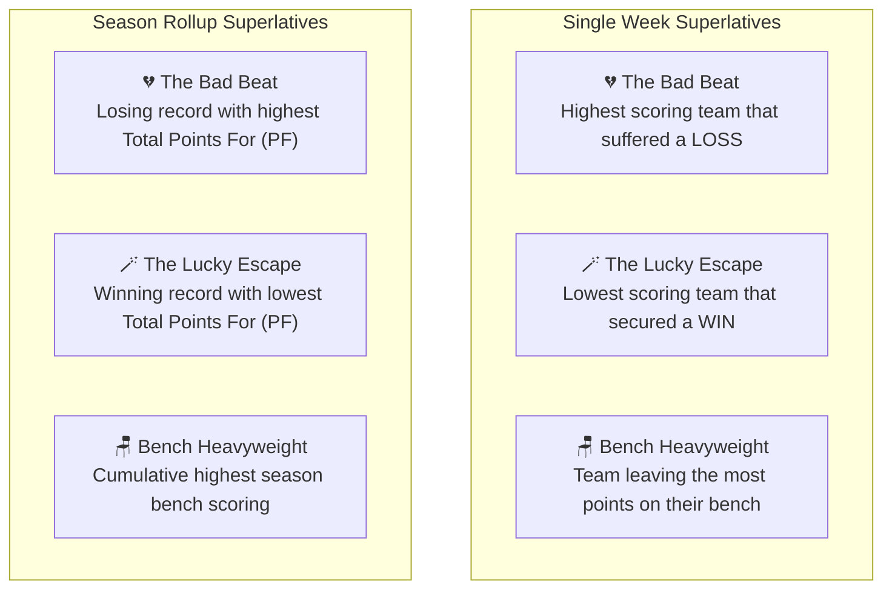

# 🧮 CrossLeague Analytics & Mathematics

This document provides complete mathematical formulations, algorithm definitions, and metric explanations for the statistical and analytical calculations in CrossLeague.

---

## 📑 Table of Contents

- [1. All-Play Record & Expected Wins (\(xW\))](#1-all-play-record--expected-wins-xw)
- [2. Schedule Luck Index](#2-schedule-luck-index)
- [3. Lineup Efficiency & Bench Points](#3-lineup-efficiency--bench-points)
- [4. Consistency Rating (Standard Deviation)](#4-consistency-rating-standard-deviation)
- [5. Cross-League Outcome Superlatives](#5-cross-league-outcome-superlatives)
- [6. Player Exposure & Positional MVPs](#6-player-exposure--positional-mvps)
- [7. Power Rankings & Tiebreaker Sorting](#7-power-rankings--tiebreaker-sorting)

---

## 1. All-Play Record & Expected Wins (\(xW\))

In standard fantasy football, head-to-head matchup schedules introduce random variance: a high-scoring team can lose to the highest scorer, while a low-scoring team can win against the lowest scorer.

**All-Play** removes schedule variance by simulating a hypothetical match against every other squad in the league for that week.

### Formulation

Let:

- \(S_i\) be the score of team \(i\).
- \(S_j\) be the score of opponent \(j\) in the same league (\(j \neq i\)).
- \(N\) be the total number of teams in the league.
- \(M = N - 1\) be the total number of simulated opponents.

For team \(i\), each opponent matchup is evaluated as:

\[
\text{Outcome}(S_i, S_j) = \begin{cases}
1.0 & \text{if } S_i > S_j \quad (\text{Win}) \\
0.5 & \text{if } S_i = S_j \quad (\text{Tie}) \\
0.0 & \text{if } S_i < S_j \quad (\text{Loss})
\end{cases}
\]

Summing across all \(M\) opponents:

\[
W_i = \sum_{j \neq i, S_i > S_j} 1, \quad T_i = \sum_{j \neq i, S_i = S_j} 1, \quad L_i = \sum_{j \neq i, S_i < S_j} 1
\]

### Expected Wins (\(xW\))

The Expected Wins for team \(i\) in a single week is the proportion of simulated victories:

\[
xW_i = \frac{W_i + 0.5 \times T_i}{N - 1}
\]

- In a 12-team league (\(N = 12, M = 11\)), the week's highest scoring squad goes `11-0-0`, earning \(xW = 1.00\).
- The week's median scoring squad goes `5-5-1` or `6-5-0`, earning \(xW \approx 0.50\).
- The lowest scoring squad goes `0-11-0`, earning \(xW = 0.00\).

### All-Play Win Percentage

\[
\text{All-Play Win \%}_i = \text{round}\left(\frac{W_i + 0.5 \times T_i}{W_i + L_i + T_i} \times 100, 1\right)
\]

---

## 2. Schedule Luck Index

The **Luck Index** isolates pure schedule fortune by comparing a manager's actual head-to-head match results with their performance-based Expected Wins.

### Formula

\[
\text{Luck}_i = \text{Actual Wins}_i - xW_i
\]

Where \(\text{Actual Wins}_i \in \{1.0, 0.5, 0.0\}\) for single-week matchups, or the cumulative sum of actual match outcomes for season rollups.

### Luck Categories

| Tier        | Condition                       | Visual Badge | Meaning                                                                                                 |
| :---------- | :------------------------------ | :----------- | :------------------------------------------------------------------------------------------------------ |
| **LUCKY**   | \(\text{Luck} \ge +0.50\)       | 🍀 Emerald   | Won a matchup despite below-average scoring, or benefited from an exceptionally weak opponent draw.     |
| **FAIR**    | \(-0.50 < \text{Luck} < +0.50\) | ⚖️ Slate     | Matchup outcome was directly aligned with scoring relative to the rest of the league.                   |
| **UNLUCKY** | \(\text{Luck} \le -0.50\)       | 💔 Rose      | Suffered a loss despite putting up a high score, running into the highest-scoring opponent of the week. |

---

## 3. Lineup Efficiency & Bench Points

Lineup Efficiency measures managerial coaching performance by evaluating how closely the actual starting lineup came to the theoretical maximum possible score from the entire roster.

### Formulas

\[
\text{Lineup Efficiency \%} = \text{round}\left(\frac{\text{Starters Score}}{\text{Optimal Score}} \times 100, 1\right)
\]

\[
\text{Bench Points} = \text{Total Roster Score} - \text{Starters Score}
\]

- **Starters Score**: The sum of points scored by players assigned to starting slots.
- **Optimal Score**: The highest possible score that could have been achieved given positional roster constraints (QB, RB, WR, TE, FLEX, K, DEF).
- A manager scoring `135.0` with an optimal potential of `140.0` achieves **96.4% Efficiency**.

---

## 4. Consistency Rating (Standard Deviation)

In Season Rollup mode, consistency is quantified using the sample standard deviation (\(s\)) with \(N - 1\) degrees of freedom across all completed weeks:

\[
\bar{S} = \frac{1}{K} \sum_{k=1}^{K} S_k
\]

\[
s = \sqrt{\frac{1}{K - 1} \sum_{k=1}^{K} (S_k - \bar{S})^2}
\]

Where:

- \(K\) is the number of active weeks played.
- \(S_k\) is the score achieved in week \(k\).
- Lower standard deviation indicates steady weekly production; higher standard deviation indicates boom-or-bust scoring.

---

## 5. Cross-League Outcome Superlatives

CrossLeague automatically identifies the defining storylines across all leagues:

### Tiebreaking Logic

- **Bad Beat (Single Week)**: `outcome === 'loss'` sorted by `points` descending.
- **Lucky Escape (Single Week)**: `outcome === 'win'` sorted by `points` ascending.
- **Bench Heavyweight**: Sorted by `benchPoints` descending.

---

## 6. Player Exposure & Positional MVPs

Player analytics aggregate player scoring and ownership statistics across every roster in all synced leagues.

### Exposure Metrics

- **Rostered Count**: Number of leagues in which the player is owned across all active squads.
- **Start Rate \%**: Percentage of active appearances where the player was placed in a starting lineup:

\[
\text{Start Rate \%} = \text{round}\left(\frac{\text{Started Count}}{\text{Started Count} + \text{Benched Count}} \times 100\right)
\]

### Positional MVP

For each standard position (`QB`, `RB`, `WR`, `TE`, `K`, `DEF`), the Positional MVP is the player with the highest weekly points (in single-week mode) or highest Average Points Per Game (Avg PPG in season rollup mode).

---

## 7. Power Rankings & Tiebreaker Sorting

Universal leaderboard and all-play rankings are sorted deterministically:

1. **Primary Sort**: All-Play Win Percentage (`allPlayWinPct`) descending.
2. **Secondary Tiebreaker**: Total Points Scored (`totalPoints` or `points`) descending.
3. **Tertiary Tiebreaker**: Head-to-Head Win Count (`wins`) descending.

### Scoring-settings compatibility

CrossLeague preserves each platform's scoring-settings payload and compares it for the selected
leagues. When the settings differ, it warns that raw team and player totals are not directly
equivalent. All-Play, Expected Wins, and Luck Index remain comparable because each calculation uses
only the teams and scores from its own league.
