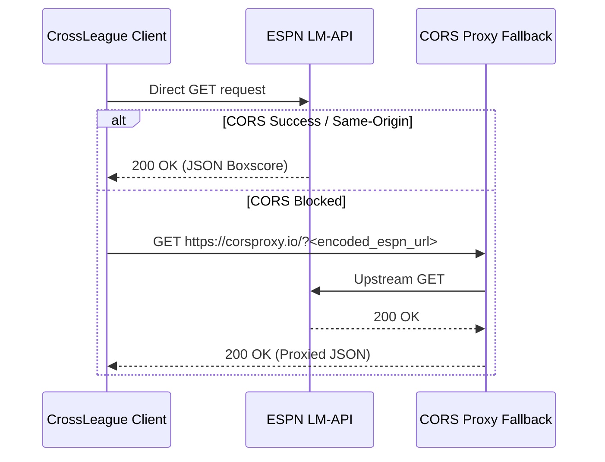

# 🔌 CrossLeague API Adapters

This document details the architecture and specifications for CrossLeague's platform adapters for the **Sleeper** and **ESPN** fantasy football APIs.

---

## 🏈 Sleeper REST API Integration

Sleeper provides a read-only, unauthenticated REST API that returns JSON payloads without requiring API keys or authentication tokens.

### Endpoints Reference

| Endpoint                                                         | Method | TTL Cache | Description                                                                 |
| :--------------------------------------------------------------- | :----- | :-------- | :-------------------------------------------------------------------------- |
| `https://api.sleeper.app/v1/state/nfl`                           | `GET`  | 2 Hours   | Current NFL week, season year, and season phase (`pre`, `regular`, `post`). |
| `https://api.sleeper.app/v1/user/{user_input}`                   | `GET`  | 15 Mins   | Resolves username or numeric ID to `user_id`, `display_name`, and `avatar`. |
| `https://api.sleeper.app/v1/user/{user_id}/leagues/nfl/{season}` | `GET`  | 15 Mins   | Returns all leagues the user participated in during the specified season.   |
| `https://api.sleeper.app/v1/league/{league_id}`                  | `GET`  | 15 Mins   | League metadata (name, total rosters, scoring settings, avatar).            |
| `https://api.sleeper.app/v1/league/{league_id}/users`            | `GET`  | 15 Mins   | League members and their team display names.                                |
| `https://api.sleeper.app/v1/league/{league_id}/rosters`          | `GET`  | 1 Hour    | Current rosters, win-loss records, points for/against, and roster IDs.      |
| `https://api.sleeper.app/v1/league/{league_id}/matchups/{week}`  | `GET`  | 1 Hour    | Weekly matchup pairs (`matchup_id`), starters, player point breakdowns.     |
| `https://api.sleeper.app/v1/players/nfl`                         | `GET`  | 24 Hours  | Full NFL player database mapping player ID to names, positions, and teams.  |

### Avatar URL Generation

Sleeper avatar hashes are constructed into CDN thumbnails via:

```javascript
export function getAvatarUrl(avatarId) {
  if (!avatarId) return null;
  return `https://sleepercdn.com/avatars/thumbs/${avatarId}`;
}
```

CrossLeague retains each league's `scoring_settings` payload so selected Sleeper leagues can be
checked for scoring-rule mismatches. ESPN uses `settings.scoringSettings` for the same purpose.

---

## 🛡️ ESPN Fantasy API Integration

CrossLeague integrates with public ESPN Fantasy Football leagues using ESPN's v3 LM-API.

### Base URL & Query Views

```
https://lm-api-reads.fantasy.espn.com/apis/v3/games/ffl/seasons/{season}/segments/0/leagues/{leagueId}?view=mMatchup&view=mRoster&view=mSettings&view=mTeam&view=modular&view=mNav
```

### CORS Handling & Proxy Fallback

Browser cross-origin resource sharing (CORS) constraints on ESPN's API are handled using direct requests followed by an automatic proxy fallback:



### ESPN Lineup Slot IDs

ESPN uses numeric slot IDs to designate starting, bench, and injured reserve slots:

| Slot ID | Slot Name | Starter Slot? | Standard Position Mapping |
| :-----: | :-------- | :-----------: | :------------------------ |
|   `0`   | **QB**    |    ✅ Yes     | QB                        |
|   `2`   | **RB**    |    ✅ Yes     | RB                        |
|   `4`   | **WR**    |    ✅ Yes     | WR                        |
|   `6`   | **TE**    |    ✅ Yes     | TE                        |
|  `16`   | **D/ST**  |    ✅ Yes     | DEF                       |
|  `17`   | **K**     |    ✅ Yes     | K                         |
|  `23`   | **FLEX**  |    ✅ Yes     | FLEX (RB/WR/TE)           |
|  `20`   | **Bench** |     ❌ No     | Bench                     |
|  `21`   | **IR**    |     ❌ No     | Injured Reserve           |

```javascript
export function isEspnStarter(slotId) {
  return slotId !== 20 && slotId !== 21;
}
```

### ESPN Player Point Resolution

ESPN stores weekly scoring alongside cumulative season totals. CrossLeague resolves the exact week's score by inspecting the `stats` array:

1. Look for `statSourceId === 0` (actual score) and `statSplitTypeId === 1` with `scoringPeriodId === targetWeekNum`.
2. Extract `appliedTotal`.
3. Prefix ESPN player IDs with `espn_` (e.g. `espn_3117251`) to avoid namespace collisions with Sleeper player IDs.

---

## 🗄️ Player Database Management

The player database client in [`src/js/api/players.js`](../src/js/api/players.js) resolves player metadata (name, position, team, headshot):

- **Sleeper**: Fetches and caches `https://api.sleeper.app/v1/players/nfl` into IndexedDB/LocalStorage.
- **ESPN**: Populates metadata directly from ESPN roster and boxscore entries during matchup processing.
- **Fallbacks**: If a player is missing from the database, defaults to a placeholder object:
  ```javascript
  { name: `Player #${id}`, pos: "FLEX", team: "FA" }
  ```
