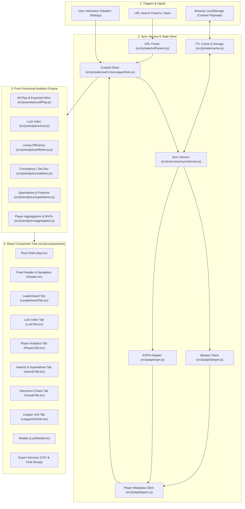
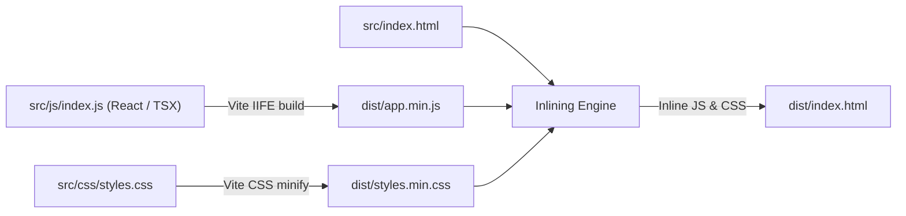

# 🏗️ CrossLeague Architecture

This document details the architectural design, runtime lifecycle, module organization, build pipeline, and design constraints of the CrossLeague application.

---

## 🎯 Architectural Principles

CrossLeague is designed around four foundational architectural pillars:

1. **Client-Side React 19 + TypeScript Application**:
   The entire user interface is rendered client-side using React 19, typed strictly with TypeScript, and styled with Tailwind CSS. There are no proprietary backend servers or server-side databases.
2. **Centralized State with Zustand**:
   Global application state (league records, user identity, week/season navigation, active filters, and sorting) is managed via a reactive Zustand store in `src/js/state/useCrossLeagueStore.js`.
3. **Pure Functional Analytics Engine**:
   All statistical and analytical algorithms in `src/js/analytics/` are pure functions that take raw matchup data and return computed results without side effects.
4. **Resilient Multi-Platform Integration**:
   Data ingestion services in `src/js/services/syncService.js` coordinate unified data normalization across **Sleeper** and **ESPN** fantasy platforms, backed by a storage-driven TTL caching layer.

---

## 🔄 End-to-End System Data Flow

The following diagram illustrates how user inputs, URL parameters, API adapters, Zustand state, and analytics flow to render the dashboard:



---

## 📁 Repository Directory Layout

```
crossleague/
├── .github/
│   └── workflows/
│       ├── ci.yaml           # Automated CI pipeline (lint, types, knip, test, build check)
│       └── publish.yaml      # Automated Cloudflare Pages deployment pipeline
├── docs/                     # Comprehensive technical documentation
│   ├── README.md             # Documentation hub index
│   ├── architecture.md       # System design and build pipeline (this file)
│   ├── analytics.md          # Analytical models & mathematical formulas
│   ├── api-adapters.md       # Sleeper and ESPN API integration
│   ├── state-and-caching.md  # Zustand store, caching, and persistence
│   ├── url-parameters.md     # Query parameter parsing & deep linking
│   ├── ui-components.md      # React components, tables, charts, and styling
│   ├── export-and-sharing.md # Chat recap, CSV, and shareable URLs
│   └── development.md        # Local development, testing, and CI/CD
├── snapshots/                # Visual regression baseline PNG snapshots (11 files)
├── scripts/
│   ├── build.js              # Vite production bundler & HTML inliner
│   └── generate-snapshots.js # Automated Chrome headless visual snapshot generator
├── src/
│   ├── css/
│   │   └── styles.css        # Glassmorphic Tailwind CSS stylesheet
│   ├── js/
│   │   ├── analytics/        # Pure analytical calculation modules
│   │   │   ├── aggregation.js    # Player ownership & positional MVP calculation
│   │   │   ├── allPlay.js        # All-Play record & Expected Wins (xW)
│   │   │   ├── efficiency.js     # Lineup efficiency & optimal potential score
│   │   │   ├── index.js          # Analytics subsystem barrel export
│   │   │   ├── luck.js           # Schedule Luck Index and classification
│   │   │   ├── statistics.js     # Standard deviation, mean, median, league averages
│   │   │   └── superlatives.js   # Podiums, Bad Beat, Lucky Escape, Bench King
│   │   ├── api/              # Upstream platform API adapters
│   │   │   ├── espn.js           # ESPN API client, slot mapping, CORS fallback
│   │   │   ├── index.js          # API subsystem barrel export
│   │   │   ├── players.js        # Sleeper & ESPN player database resolution
│   │   │   └── sleeper.js        # Sleeper REST client and matchup parser
│   │   ├── components/       # React 19 components & UI views
│   │   │   ├── App.tsx           # Application root component & shell
│   │   │   ├── charts.js         # Imperative Chart.js canvas renderer
│   │   │   ├── common/           # Shared components (Toast, MobileBottomNav)
│   │   │   ├── header/           # Header, WeekNavigator, LeagueDropdown
│   │   │   ├── modals/           # LuckModal and dialogs
│   │   │   ├── summary/          # Podium and SummaryCards
│   │   │   └── tabs/             # Active dashboard tabs
│   │   ├── export/           # Export and sharing utilities
│   │   │   ├── csv.js            # CSV spreadsheet dataset generator
│   │   │   ├── index.js          # Export subsystem barrel export
│   │   │   ├── recap.js          # Markdown / HTML chat recap generator
│   │   │   └── share.js          # Shareable deep-link URL builder
│   │   ├── services/         # Application services
│   │   │   └── syncService.js    # Multi-platform data loading and synchronization
│   │   ├── state/            # State management and caching
│   │   │   ├── cache.js          # TTL API caching & localStorage manager
│   │   │   ├── constants.js      # Global constants, platform maps, colors
│   │   │   ├── preferences.js    # User preferences persistence
│   │   │   ├── urlParams.js      # URL query parameter synchronization
│   │   │   └── useCrossLeagueStore.js # Central Zustand reactive state store
│   │   ├── types/            # TypeScript type definitions
│   │   │   └── index.ts          # Core data models and component types
│   │   └── index.js          # Application bootstrap & entry point
│   └── index.html            # Vite development HTML template
├── dist/                     # Production build artifacts
│   ├── app.min.js            # Minified IIFE bundle (+ sourcemap)
│   ├── styles.min.css        # Minified CSS bundle
│   └── index.html            # Standalone zero-dependency inlined HTML app
├── tests/                    # Native Node.js test suite (`node:test`)
├── eslint.config.js          # ESLint flat config
├── knip.json                 # Unused code analyzer configuration
├── tsconfig.json             # TypeScript compiler configuration
├── wrangler.jsonc            # Cloudflare Pages deployment configuration
├── package.json              # Package metadata and dependencies
└── Taskfile.yaml             # Development and CI task orchestration
```

---

## ⚙️ Build and Distribution Pipeline

The build process is orchestrated by [`scripts/build.js`](../scripts/build.js) using [Vite](https://vitejs.dev/) programmatic APIs:



1. **JavaScript Bundling**:
   `src/js/index.js` (including all React components and dependencies) is compiled and bundled into an IIFE named `CrossLeague` at `dist/app.min.js`.
2. **CSS Minification**:
   `src/css/styles.css` is minified into `dist/styles.min.css`.
3. **Inlined Standalone Application**:
   `src/index.html` is parsed, and script/style tags are replaced with inlined code to create `dist/index.html`, which can run offline in any browser or be served via Cloudflare Pages.
