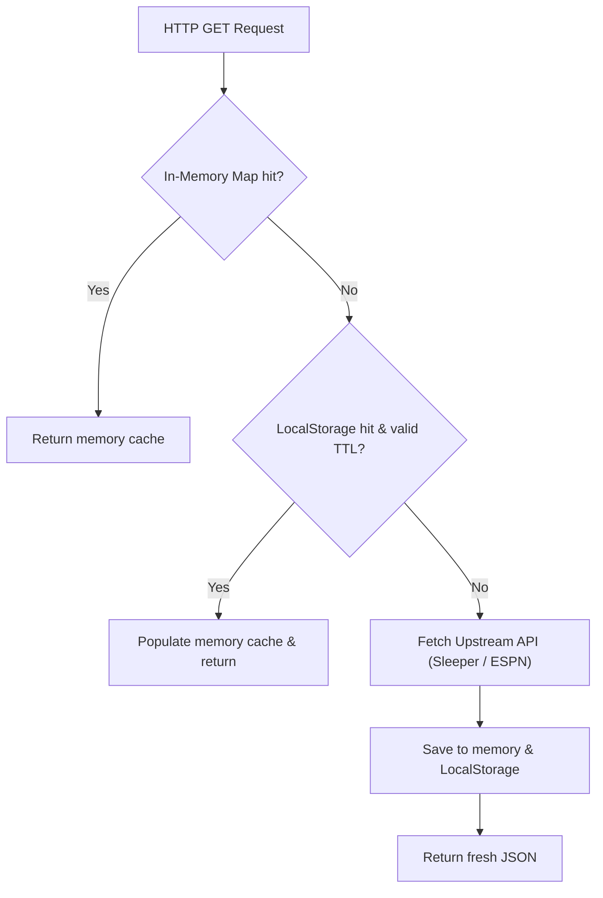

# 💾 State Management & Caching

This document covers CrossLeague's state management model with **Zustand**, browser `localStorage` caching policies, TTL API request caching, and week status evaluation.

---

## 🏛️ Central Zustand Store (`src/js/state/useCrossLeagueStore.js`)

CrossLeague manages reactive application state through a centralized Zustand store. React components subscribe to fine-grained state slices via selector hooks to optimize rendering performance.

### Store State Schema

```typescript
interface CrossLeagueState {
  // Platform & View Mode
  currentPlatform: "sleeper" | "espn";
  currentMode: "WEEKLY" | "SEASON_ROLLUP";
  currentSyncType: "user" | "leagues";
  currentTab: "board" | "luck" | "players" | "awards" | "visuals" | "leagues";

  // Identity & Target League IDs
  currentUserId: string;
  currentUserName: string;
  currentUserAvatar: string;
  customLeagueIds: Set<string>;
  selectedLeagueIds: Set<string>;

  // Datasets
  rawRecords: TeamRecord[];
  leaguesMap: Record<string, LeagueInfo>;
  allLeaguesData: RawLeague[];
  espnPlayersDb: Record<string, PlayerMetadata>;

  // Leaderboard UI State
  currentSortColumn: string;
  currentSortAsc: boolean;
  currentTierFilter: "ALL" | "PLAYOFF" | "BUBBLE" | "ELIMINATED";
  searchQuery: string;
  expandedRowIds: Set<string>;
  currentMainPage: number;
  currentMainPageSize: number;

  // Player Analytics UI State
  currentPlayerPositionFilter: string;
  currentPlayerSearch: string;
  currentPlayerStatusFilter: string;
  currentPlayerSortColumn: string;
  currentPlayerSortAsc: boolean;
  expandedPlayerIds: Set<string>;
  currentPlayerPage: number;
  currentPlayerPageSize: number;

  // Luck Table UI State
  currentLuckPage: number;
  currentLuckPageSize: number;
  currentLuckSearch: string;
  currentLuckCategory: "ALL" | "LUCKY" | "UNLUCKY" | "FAIR";
  currentLuckSortColumn: string;
  currentLuckSortAsc: boolean;
  isLuckModalOpen: boolean;

  // NFL Calendar State
  nflState: {
    season: number;
    week: number;
    display_week: number;
    season_type: "pre" | "regular" | "post" | "off";
  };
}
```

### Key Custom Hooks & Selectors

- **`useActiveRecords()`**: Returns `rawRecords` filtered by `selectedLeagueIds`.
- **`useActiveLeaguesMap()`**: Returns a subset of `leaguesMap` for selected leagues.
- **`useCrossLeagueStore(s => s.actionName)`**: Access store mutators (e.g. `setRawRecords`, `setSelectedLeagueIds`, `setCurrentTab`, `toggleExpandedRow`).

---

## ⚡ Multi-Tier Caching Architecture

To prevent redundant network requests and avoid API rate limits, CrossLeague implements a two-tier caching strategy:



### 1. In-Memory Request Cache

An active JavaScript `Map` holds in-flight and recent API responses for sub-millisecond retrieval.

### 2. Storage-Backed TTL Cache (`src/js/state/cache.js`)

Persistent API responses are serialized to `localStorage` under `crossleague_api_cache_*` with expiration timestamps:

```json
{
  "_ts": 1726728000000,
  "ttlMs": 900000,
  "data": { ... }
}
```

---

## 🔑 Cache Key Schemas

CrossLeague partitions cached reports by platform, normalized username, season, mode, and week:

```
crossleague_cache_{platform}_{normalizedUsername}_{season}_{mode}_{week}
```

**Example**:
`crossleague_cache_sleeper_juftin_2024_WEEKLY_4`

---

## 📅 Finished Week Evaluation (`isWeekFinished`)

Historical matchups that have finalized are immutable and cached with extended TTL:

```javascript
export function isWeekFinished(weekNum, seasonYear, nflState) {
  const currentSeason = nflState.season;
  const currentWeek = nflState.week || nflState.display_week;
  const seasonType = nflState.season_type;

  // 1. Past calendar seasons are permanently finished
  if (seasonYear < currentSeason) return true;

  // 2. Future calendar seasons are not finished
  if (seasonYear > currentSeason) return false;

  // 3. In post-season / off-season, all regular season weeks (1-18) are complete
  if (seasonType === "post" || seasonType === "off") return true;

  // 4. In active regular season, strictly prior weeks are finished
  return weekNum < currentWeek;
}
```
