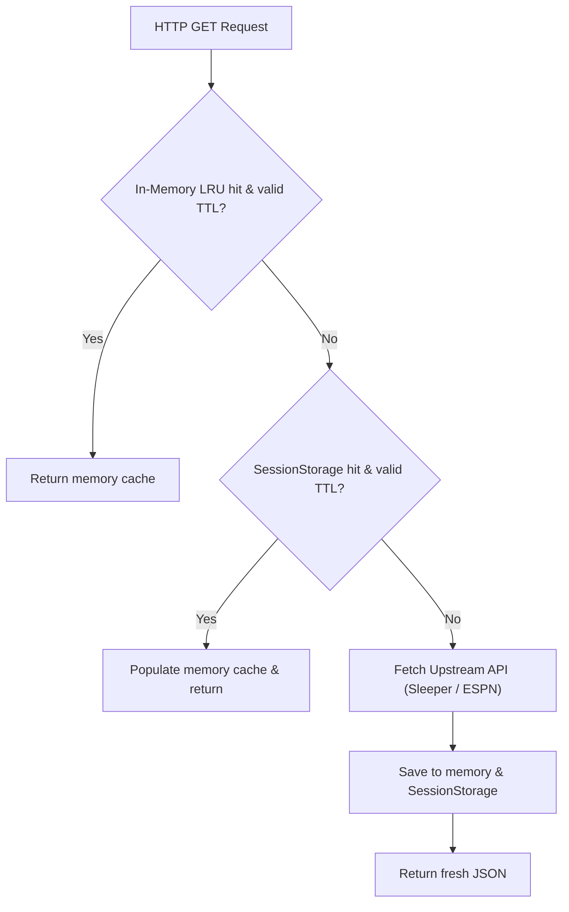

# 💾 State Management & Caching

This document covers CrossLeague's reactive state management with **Zustand**, namespaced browser storage policies with automatic LRU cache pruning, multi-tier API and report caching, and week status evaluation.

---

## 🏛️ Central Zustand Store (`src/js/state/useCrossLeagueStore.js`)

CrossLeague manages reactive application state through a centralized Zustand store. React components subscribe to fine-grained state slices via selector hooks to optimize rendering performance.

### Store State Schema

```typescript
interface CrossLeagueState {
  // Platform & View Mode
  platform: "sleeper" | "espn";
  mode: "WEEKLY" | "SEASON_ROLLUP";
  syncType: "user" | "leagues";
  activeTab: "awards" | "leaderboard" | "visuals" | "leagueGrid" | "luck" | "players";

  // Identity & Target League IDs
  userId: string;
  userName: string;
  userAvatar: string;
  customLeagueIds: string[];
  sleeperUserName: string;
  sleeperUserId: string;
  sleeperSyncType: "user" | "leagues";
  sleeperCustomLeagueIds: string[];
  espnCustomLeagueIds: string[];
  selectedLeagueIds: string[];
  pendingLeagueIdsFilter: string[] | null;

  // Datasets
  rawRecords: TeamRecord[];
  leaguesMap: Record<string, LeagueInfo>;
  allLeaguesData: any[];
  espnPlayersDb: Record<string, PlayerMetadata>;
  sleeperPlayersDb: Record<string, PlayerMetadata> | null;

  // UI State & Filters
  loading: boolean;
  progress: number;
  error: string | null;
  searchQuery: string;
  sortColumn: string;
  sortAsc: boolean;
  tierFilter: "ALL" | "PLAYOFF" | "BUBBLE" | "ELIMINATED";
  mainPage: number;
  mainPageSize: number;
  expandedRowIds: string[];

  // NFL Calendar State
  nflState: {
    season: number;
    week: number;
    display_week: number;
    season_type: "pre" | "regular" | "post" | "off";
  };
}
```

### Key Custom Hooks & Selectors

- **`useActiveRecords()`**: Returns `rawRecords` filtered by `selectedLeagueIds`.
- **`useActiveLeaguesMap()`**: Returns a subset of `leaguesMap` for selected leagues.
- **`useCrossLeagueStore(s => s.actionName)`**: Access partitioned store mutators (e.g. `setPlatform`, `setSleeperUser`, `setSleeperSyncType`, `setSleeperCustomLeagueIds`, `setEspnCustomLeagueIds`, `setMode`, `setSeason`, `setWeek`, `hydratePreferences`).

---

## ⚡ Multi-Tier Caching Architecture

To prevent redundant network requests and avoid API rate limits, CrossLeague implements a multi-tier caching strategy:



### 1. In-Memory LRU Cache

A bounded in-memory `Map` (max 120 entries) caches active API responses with sub-millisecond retrieval.

### 2. SessionStorage API Cache (`src/js/state/cache.js`)

Session-level API responses are serialized under `crossleague:cache:api:*` with expiration timestamps (`ttlMs`).

### 3. Persistent Report Cache & LocalStorage (`src/js/state/storage.js`)

Weekly team records, leagues, and matchup data are stored with structured TTLs and automatic LRU eviction:

- **Active / Current Weeks**: 10 minutes TTL (`TTL.REPORT_ACTIVE`).
- **Finalized / Historical Weeks**: 7 days TTL (`TTL.REPORT_FINISHED`).
- **Player Databases**: 24 hours TTL (`TTL.PLAYERS_DB`).

---

## 🔑 Key Schemas & Namespaces

CrossLeague standardizes all persistent keys under the `crossleague:` namespace:

| Domain              | Key Pattern                                                           | Description                             |
| :------------------ | :-------------------------------------------------------------------- | :-------------------------------------- |
| **Preferences**     | `crossleague:pref:platform`                                           | Active platform (`sleeper` \| `espn`)   |
| **Preferences**     | `crossleague:pref:username`                                           | Saved Sleeper username                  |
| **Preferences**     | `crossleague:pref:user_id`                                            | Saved Sleeper numeric user ID           |
| **Preferences**     | `crossleague:pref:custom_leagues`                                     | Active custom league ID array           |
| **Preferences**     | `crossleague:pref:sleeper_username`                                   | Saved Sleeper username                  |
| **Preferences**     | `crossleague:pref:sleeper_custom_leagues`                             | Platform-isolated Sleeper league IDs    |
| **Preferences**     | `crossleague:pref:espn_custom_leagues`                                | Platform-isolated ESPN league IDs       |
| **Preferences**     | `crossleague:pref:season`                                             | Active season year                      |
| **Preferences**     | `crossleague:pref:week`                                               | Active matchup week                     |
| **Preferences**     | `crossleague:pref:mode`                                               | Sync mode (`WEEKLY` \| `SEASON_ROLLUP`) |
| **Report Cache**    | `crossleague:cache:report:{platform}:{target}:{season}:{mode}:{week}` | Weekly normalized matchup report        |
| **API Cache**       | `crossleague:cache:api:{url}`                                         | Upstream HTTP endpoint response         |
| **Player Database** | `crossleague:cache:players:sleeper`                                   | Normalized Sleeper fantasy players DB   |
| **Player Database** | `crossleague:cache:players:espn`                                      | Cached ESPN player metadata             |

### Platform Preference Isolation

To prevent cross-contamination between platforms (e.g. ESPN league IDs accidentally sent to Sleeper, or Sleeper usernames passed to ESPN), CrossLeague preserves separate platform-scoped preferences (`sleeperCustomLeagueIds`, `espnCustomLeagueIds`, `sleeperUserName`). When switching between ESPN and Sleeper in the Settings menu, each platform's saved entries are restored without overwriting the other.

### Backward Compatibility Migration

The storage layer (`storage.js`) automatically reads from legacy key names (e.g. `sleeper_username`, `sleeper_season`, `crossleague_platform`, `crossleague_cache_*`) if modern keys are not yet set, guaranteeing seamless upgrades for existing users.

---

## 🧹 Quota Protection & LRU Cache Eviction

Browser `localStorage` typically enforces a strict 5MB quota. CrossLeague prevents quota exhaustion through:

1. **Deduplicated Payloads**: Full player databases are stored once in dedicated caches, keeping weekly report payloads lightweight.
2. **`pruneCache` Eviction Engine**: If a write fails due to `QuotaExceededError`, CrossLeague automatically removes expired cache entries first, followed by the oldest active week caches.

---

## 📅 Finished Week Evaluation (`isWeekFinished`)

Historical matchups that have finalized are immutable and cached with extended TTL:

```javascript
export function isWeekFinished(season, week, nflState) {
  const s = parseInt(season, 10);
  const w = parseInt(week, 10);
  if (!nflState || !nflState.season) return false;

  // 1. Past calendar seasons are permanently finished
  if (s < nflState.season) return true;

  // 2. In post-season / off-season, all regular season weeks (1-18) are complete
  if (s === nflState.season) {
    if (nflState.season_type === "post" || nflState.season_type === "off") return true;
    const currentNflWeek = nflState.week || nflState.display_week || 1;
    return w < currentNflWeek;
  }

  return false;
}
```
