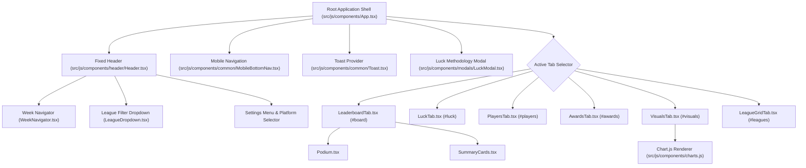

# 🎨 React UI Components & Visualizations

CrossLeague features a responsive, dark-mode glassmorphic interface engineered with **React 19**, **TypeScript**, **Tailwind CSS**, and Lucide React icons.

---

## 💎 Visual Design System & Styling Tokens

CrossLeague utilizes a dark glassmorphic styling system defined in [`src/css/styles.css`](../src/css/styles.css):

- **Background Canvas**: Deep slate/navy gradients (`#0b0f19` to `#020617`).
- **Glassmorphic Panels (`glass-card`)**: Translucent panels with background blur (`backdrop-blur-md bg-slate-900/60 border border-slate-800/80 shadow-2xl`).
- **Iconography**: Lucide React icons are used across controls and metrics; the CrossLeague bolt is rendered by the shared `BrandBoltIcon` component and dedicated light/dark SVG assets.
- **Color Coding**: Emerald greens for high scoring and lucky draws, rose for bad beats and unlucky schedules, and cyan/violet for platform identity.

---

## 🧩 Component Architecture

---

## 📊 Component Deep-Dives

### 1. Root Application Shell (`src/js/components/App.tsx`)

- Mounts the application and initializes user preferences and URL parameters.
- Manages dynamic top padding to accommodate fixed header heights across desktop, tablet, and mobile views.
- Subscribes to the active tab from the Zustand store to render the appropriate view.

### 2. Fixed Header & Controls (`src/js/components/header/Header.tsx`)

- Contains the theme-aware brand logo and favicon, platform indicator (`#headerPlatformBadge`), and season badge.
- Houses the **WeekNavigator**, **LeagueDropdown**, Sync button, Share button, and Settings dropdown menu.
- Hosts the desktop navigation tab bar.

### 3. Universal Leaderboard & Podium (`LeaderboardTab.tsx`, `Podium.tsx`, `SummaryCards.tsx`)

- Renders the Top-3 gold, silver, and bronze squad cards.
- Displays the multi-league rankings table with expandable starting lineup details.
- Supports multi-column sorting (Points, All-Play Win %, Luck, Optimal Points) and client-side pagination.

### 4. Schedule Luck & Expected Wins (`LuckTab.tsx`, `LuckModal.tsx`)

- Displays weekly records, Expected Wins ($xW$), and color-coded Luck Index badges.
- Provides quick-filter buttons: `ALL`, `LUCKY` ($\ge +0.5$), `UNLUCKY` ($\le -0.5$), and `FAIR`.
- Hosts the interactive **Luck Methodology Modal** explaining All-Play calculations.

### 5. Player Exposure & Positional MVPs (`PlayersTab.tsx`)

- Highlights Positional MVPs across QB, RB, WR, TE, K, and DEF.
- Displays multi-league ownership rates, start/bench ratios, and rostered manager badges with expanders.

### 6. Interactive Charts (`VisualsTab.tsx`, `charts.js`)

- **Score Distribution Chart**: Histogram of scores grouped into statistical bins.
- **League Scoring Comparison**: Bar chart comparing Average Points Per Game (Avg PPG) across all leagues.
- **Scoring Settings Warning**: A modal warns when selected leagues report different scoring rules;
  raw point totals across those leagues are not directly equivalent.
- **Player Analytics Scope**: Player ownership and start rates span selected leagues, while a player's
  displayed weekly points use one league's score (the highest available score), rather than a
  cross-league sum. Season Avg PPG aggregates recorded selected-league scores and is not normalized.
- Retains imperative Chart.js canvas renderers integrated via React `useEffect` refs, with theme-aware canvas text, grid, legend, and tooltip colors.
- Shared chart-help popovers use a high-contrast white surface in light mode and a slate surface in dark mode.
